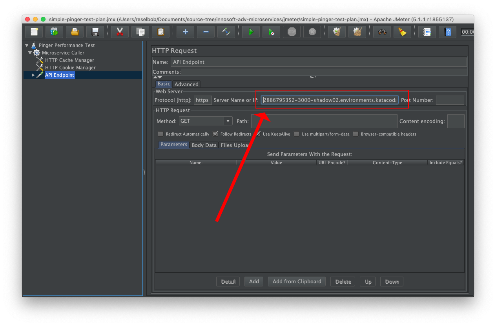

# Performance Testing with JMeter

## Installation

Follow the download instructions found [here](https://jmeter.apache.org/download_jmeter.cgi). You'll be asked to download a zip file and unzip the contents into your application directory. In MAC/OSX this is typically the `Applications` directory. In Windows, it's `Program Files`.

Be advised that the latest verision of JMeter needs have Java 8 installed on the host machine.

Once installed, you'll find the executable in the `./bin` directory. The executable file for MAX/OSX is `jmeter`. For Windows, it's `jmeter.bat`.

(You find detailed instructions for intalling JMeter [here](https://jmeter.apache.org/usermanual/get-started.html#install).)

## Running a Test

**Step 1:** Go to the GitHub respository that contains the `pinger` application and follow the instructions to get the application up and running on Katacoda. You'll find the instructions [here](https://github.com/reselbob/pinger#building-and-running-pinger-as-a-docker-container-on-katacoda).

**Step 2:** Save the public URL that was created when you brought up `pinger` under Katacoda. (The process is discussed in setup instructions described above in **Step 1**.

**Step 3:** Start up JMeter.

MAC/OSX

`sh <JMETER_APP_DIRECTORY>/bin/jmeter.sh`

Windows

`<JMETER_APP_DIRECTORY>/bin/jmeter.bat`

You'll be presented with the UI shown below.

**Step 4:**

**Step 5:**

**Step 5:**

**Step 6:**

**Step 7:**

**Step 8:**

**Step 9:**

**Step 10:**

**Step 11:**

**Step 12:**

**Step 13:**

**Step 14:**

**Step 15:**

