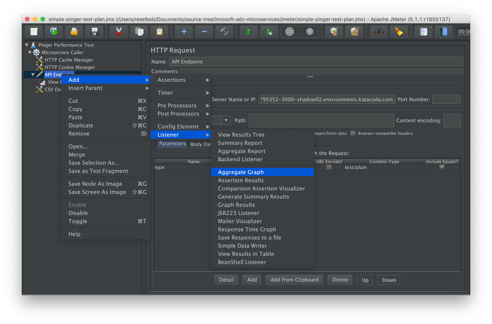

# Performance Testing with JMeter

## Installation

Follow the download instructions found [here](https://jmeter.apache.org/download_jmeter.cgi). You'll be asked to download a zip file and unzip the contents into your application directory. In MAC/OSX this is typically the `Applications` directory. In Windows, it's `Program Files`.

Be advised that the latest verision of JMeter needs have Java 8 installed on the host machine.

Once installed, you'll find the executable in the `./bin` directory. The executable file for MAX/OSX is `jmeter`. For Windows, it's `jmeter.bat`.

(You find detailed instructions for intalling JMeter [here](https://jmeter.apache.org/usermanual/get-started.html#install).)

## Running a Test

**Step 1:** Go to the GitHub respository that contains the `pinger` application and follow the instructions to get the application up and running on Katacoda. You'll find the instructions [here](https://github.com/reselbob/pinger#building-and-running-pinger-as-a-docker-container-on-katacoda).

**Step 2:** Save the public URL that was created when you brought up `pinger` under Katacoda. (The process is discussed in setup instructions described above in **Step 1**.

**Step 3:** Start up JMeter.

MAC/OSX

`sh <JMETER_APP_DIRECTORY>/bin/jmeter.sh`

Windows

`<JMETER_APP_DIRECTORY>/bin/jmeter.bat`

You'll be presented with the UI shown below.


**Step 4:** We're going to add a pre-existing preformance test that is saved to a a file, `simple-pinger-test-plan.jmx`.

Click the open file icon on the upper left of the JMeter icon bar as shwown in the figure below.


Once you click the icon, an Open dialog appears.

**Step 5:** Navigate your local file system to the location where you cloned the source code for this exercise from GitHub. Select the file,  `simple-pinger-test-plan.jmx` and click the Open button on the lower right of the dialog box.


**Step 6:**: You'll see test plan load into the UI as shown in the figure below.


**Step 7:** Next need to substitute the default URL to an aribtrary instance of `pinger` running on Katacoda with the actual URL for the instance you created in **Step 1**.

Click the test plans HTTP Request, named `API Endpoint` as shown on the left side of the figure below. You'll be presented the HTTP Request UI. The value we're going to substitute is the one in the `Server Name or IP` textbox as shown in the illustration below.


**Step 8:** Go back to the Katacoda web page were your instance of `pinger` is running. Copy the Katacoda domain name that is particular to your running instance. The figure below shows an example of a domain name to copy.


Yours will be different.

**Step 9:** Paste the domain name copied in the previous step into the `Server Name or IP` textbox as shown in the illustration below.


**Step 10:** Next we need to as the `csv` file that will contain the query parameters that the performance test will cycle through.

Select right click on thread group, `Microservice Caller` then click, `Add` followed by `Config Element` and then `CSV Data Set Config` as shown in the figure below.


The `CSV Data Set Config` dialog will appear.

**Step 11:** Select the `Browse` button as shown in the figure below.


The file `Open` dialog will appear.

**Step 12:** Navigate to this `jmeter` directory in this project's directory on your local file system and select the file, `pinger-params.csv.`. Select the file and then click the `Open` button.


The contets of the file, `pinger-params.csv` is shown below.

```text
type
networkInfo
requestHeaders
envVars
memoryUsage
requestUrl
remoteAddress
```
The `csv` file describes the the query string parameters that are suppoted by the microservice, `pinger`.

**Step 13:** The full path of the `csv` will be in the `filename` textbox of the CSV Data Set Config UI, as shown below. 


**Step 14:** We're going to increase the `Loop Count` of the thread group that is executing the text. We nee to increase the `Loop Count` in order to ensure that all the query string values defined in the  `csv` are called.

Click the thread group, `Microservice Caller` on the left side of the JMeter Ui. You'll see the `Loop Count` textbox in the center of the UI, as shown in the figure below.


**Step 15:** The increase the value in the `Loop Count` textbox from 1 to 10. Also, decrease the value in the `Ramp-Up Perios (in seconds) from 10 to 5.


**Step 16:** Next we need to configure the HTTP Request to call the values defined in the `csv`. file,

Click on the HTTP Request titled, `API Endpoint`. This will display the HTTP Request UI.

At the bottom of the UI you'll see a section, `Send Parameters With the Request`. Click the `Add` button. A new row will appear.

Enter the string, `type` in the Name column. Enter the string `${type} in the Value column,

**WHERE**

* `type` is the value in the heading row of the `csv` file,
*  `${type}` is a variable into which each value in each row of the `csv` will be assigned.


**Step 17:** Now we'll run the test. Click `View Results Tree` as shown in the figure below (1).  The `View Results Tree` is a type o [JMeter Listener](https://jmeter.apache.org/usermanual/listeners.html) that captures responses from an HTTP request.

Click the green Start arrow icon (2). This will invoke the test. You'll see the responses appear the Test panel of the `View Results Tree` Listener (3).

Click the `Response Body` tab in the `View Results Tree` Listener (4). You'll see the JSON emitted as a response from the `pinger` microservice in the `Response Body` panel (5). (See the figure below.) 


**Congratulations!** You've just completed a basic JMeter test that's data driven using a `csv` file.

For an added experience visualizing test results, add a `Aggregate Graph` Listener to the test, run the test again and observe the results.

