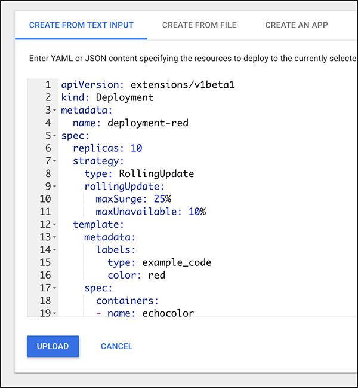

# Using the Kubernetes Dashboard

The purpose of this exercise is to create a Kubernetes deployment and Kubernetes service using the Kubernetes Dashboard.

**Step 1:** Go to the Katacoda Minikube Playground:

`https://katacoda.com/javajon/courses/kubernetes-fundamentals/minikube`

Start minikube:

`minikube start`


**Step 2:** Click the Kubernetes Dashboard tab in the menu of the Katacoda interactive learning environment.

**Step 3:** Click the `Create` button on the right side of the Dashboard. This will expose the Dashboard's YAML input editor.


**Step 4:** Copy the following YAML file into the iput editor.

```yaml

apiVersion: extensions/v1beta1
kind: Deployment
metadata:
  name: deployment-red
spec:
  replicas: 10
  strategy:
    type: RollingUpdate
    rollingUpdate:
      maxSurge: 25%
      maxUnavailable: 10%
  template:
    metadata:
      labels:
        type: example_code
        color: red
    spec:
      containers:
      - name: echocolor
        image: reselbob/echocolor:v0.1
        ports:
        - containerPort: 3000
        env:
        - name: COLOR_ECHO_COLOR
          value: RED
        - name: COLOR_ECHO_VERSION
          value: V1
```

like so:



Then click the UPLOAD button.

You've now adde a deployment named, `deployment-red` to the cluster. The deployment will create 10 pods using the continaer image, `reselbob/echocolor:v0.1`.

eselbob/echocolor:v0.1

**Step 5:** Go back to the input editor and add the following YAML file for a Kubernetes service by pasting the following code into the input put window.

```yaml
apiVersion: v1
kind: Service
metadata:
  name: echocolor-red
spec:
  selector:
    type: example_code
    color: red
  ports:
  -
    protocol: TCP
    port: 3000
    targetPort: 3000
  type: NodePort
```

Then click the input editor's UPLOAD button. You have now create a Kubernetes service named, `echocolor-red` that will be bound to all pods that have the labels, `type: example_code` and `color: red`.

**Step 6:** Return to the Katacoda interactive terminal. Let's see the services that are now running in the cluster. Type the following command:

`kubectl get services`

You'll get output similar to the following:

```text
NAME            TYPE        CLUSTER-IP      EXTERNAL-IP   PORT(S)          AGE
echocolor-red   NodePort    10.108.222.34   <none>        3000:30463/TCP   34s
kubernetes      ClusterIP   10.96.0.1       <none>        443/TCP          5m14s
```

Take notice of the NodePort assignment for service, `echocolor-red`, which in this case is, `30463`.


**Step 6:** Get the IP address of the cluster.

`kubectl cluster-info`

You'll get output similar to the following:

```text
Kubernetes master is running at https://172.17.0.42:8443
KubeDNS is running at https://172.17.0.42:8443/api/v1/namespaces/kube-system/services/kube-dns:dns/proxy
```

In this case the IP address of the cluster is `172.17.0.42`.

**Step 7:** Call the service, `echocolor-red`

`curl <IP_OF_CLUSTER>:<NODE_PORT>`

In this case:

`curl 172.17.0.42:30463`

You'll get output similar to the following:

```javascript
{
    "color": "RED",
    "date": "2019-10-20T07:33:46.998Z"
}
```

**CONGRATULATIONS!** You've used the Kubernetes Dashboard to create a Kubernetes deployment and service. The execise is complete.


