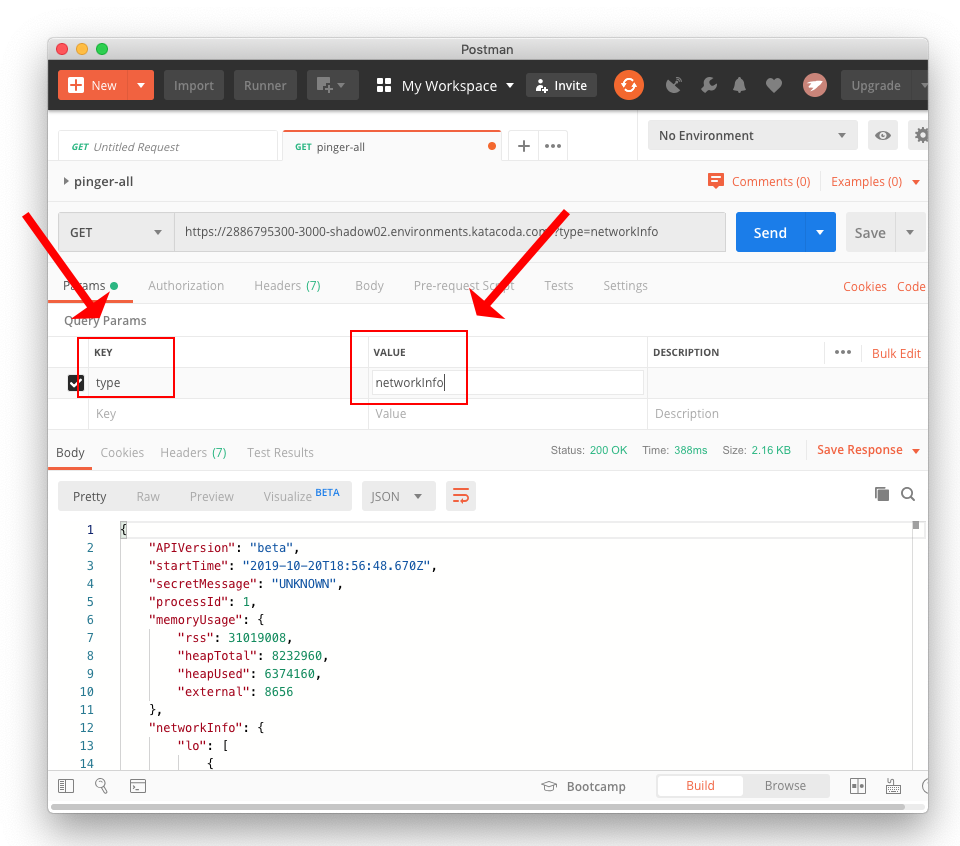

# Working with Postman to Exercise a Microservice

The purpose of this lab is to provide an experience in which a student get a microservice up and running at a remote location and then exercises that microservice using [Postman](https://www.getpostman.com/). (You'll need to have Postman installed on your local machine.)

In this lab the microservice we're going to install and invoke is [`pinger`](https://github.com/reselbob/pinger).

**Step 1:** Install `pinger` on Katacoda running as a Docker container. Follow the instructions found [here](https://github.com/reselbob/pinger#building-and-running-pinger-as-a-docker-container-on-katacoda).

Part of the instructions referenced above shows you how to expose  `pinger` at a public URL on Katacoda. The illustration below shows a URL generated by a previous implmentation of `pinger` on Katacoda.

Your installation will have URL of its own. Save your particular URL to `pinger`. You're going to need it when you work with Postman.

**Step 2:** Start up PostMan.

**Step 3:**  Once you start Postman for the first time, you'll be presented with a dialog windows from which you celect `Postman Window` as shown in the illustration below.

**Step 4:** Click the `Request` icon as shown in the illustration below.

**Step 5:** Enter a value in the `Request name` textbox. The enter a short description in the `Request description` textbox as shown in the illustration below.

**Step 6:** Scroll down the dialog window. You'll see a button on the right, `Create Collection`. (The organizational unit for requests in Postman is a collection.) Click the button, `Create Collection` as shown in the illustration below.

**Step 7:** Enter a name for the collection in the textbox. In the illustration below the collection name entered is `adv-microservices`. You can use that name or choose your own.

After you've entered a name for the collection, click the check at the right of the textbox to save the collection name.

**Step 8:** Once you've entered a name for the request, a description and declared a collection, click the button, `Save to [colllection-name]`.

**Step 8:** Now we're ready to have Postman execute a GET request. Copy the URL for `pinger` service that we created in Katacoda back in **Step 1** into the request textbox as shown in the figure below.

Once you've entered the `pinger` URL, click the `Send` button to the right of the URL textbox.

**Step 10:** You'll see the response from `pinger` appear in the `Body` section of the response. Congratulations! You've made your first request.

(**Please be advised**, sometimes the Katacoda web site might time out. In such a case you'll get an error. If so, go through the process of running `pinger` in Katacoda againt.

**Step 11:** Now let's go through the process of adding query string parameter to the request. Postman has a section in the UI named, `Query Params` as you can see in the illustration below.

In this step we're going to add the query parameter, `type=networkInfo` to the request. There are two ways to do this. Once way is to just append the query string to the URL. The other way is to use the `Query Params` feature in the UI. We'll use the `Query Params` feature.

Go to the `Query Params` section in the Postman UI and at the string `type` in the **KEY** column. The add the string, `networkInfo` in the **VALUE** column. (This query parameter is special to `pinger`. The way `pinger` works is that it allows you to filter the information emitted by `pinger` according to a category. In this case, we're getting `networkInfo` information.

**Step 12:** Postman allows you to view information about a particulary request in raw form. To do this, click the `Code` button at the right of the `Query Params` section, as shown in the illustration below.

**Step 13:**  When you click the `Code` button a dialog appears that displays information about the request in raw format.

Click the `X` in the upper right of the dialog window to close it.

**Step 14:**  Notice that the information we added in the `Query Params` section of the Postman UI is automatically appended to the Katacoda URL as `?type=networkInfo`. 

Click the `Send` button to execute the request.

Notice that the only `networkInfo` information has been returned in the response from `pinger`.

**Step15:** Postman allows you to view the HTTP headers that are returned as part of the response. To view the HTTP headers for the response from `pinger`, click the `Headers` tab in the response section of the Postman UI, as shown in the figure below.

The headers will appear in a table displayed in the Postman UI. The illustration aboves shows an example of the table.

**Step16:** Now that you've learned the basics of doing an HTTP Request using Postman, create additional requests that get information from `pinger` according to the following query paramaters.

* `type=envVars`
* `type=memoryUsage`
* `type=currentTime`
* `type=requestUrl`
* `type=remoteAddress`
