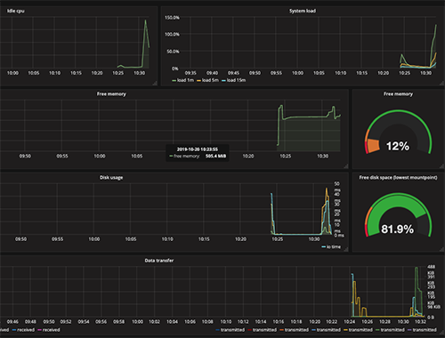

# Working With Promethus And Grafana

The purpose of this lab is demonstrate how to view a microservice oriented archticture's operational metrics under Prometheus and Grafana.

**Step 1:** Take the step-by-step instructions for setup up a Prometheus-Grafana instance found [here](https://katacoda.com/courses/prometheus/creating-dashboards-with-grafana).

**Step 2:** Once you get Promethus and Grafana up and running in Katacoda, open a **third terminal window** in the Katacoda interactive environment. You're going to install the `food court` microservice oriented application (MOA)that runs under Docker Compose.

**Step 3:** Clone the code from the GitHub respository.

`git clone https://github.com/reselbob/dockerdemos.git`

**Step 4:** Navigate to this Food Court project

`cd dockerdemos/foodcourt/`

**Step 5:** Bring up the application under Docker Compose

`docker-compose up -d`

It will take a minute or two for the application's images to build and the containers
to run.

When  the process completes you'll get output similar to the following

```text
Creating foodcourt_hobos_1 ...
Creating foodcourt_iowafried_1 ...
Creating foodcourt_customer_1 ...
Creating foodcourt_burgerqueen_1 ...
Creating foodcourt_hobos_1
Creating foodcourt_iowafried_1
Creating foodcourt_customer_1
Creating foodcourt_iowafried_1 ... done
```

**Step 6:** Once `docker-compose` is up and running, try the following bash `for` loop
 that runs a `curl` command against the Food Court Service running under HTTP.
 


`for i in {1..20}; do curl localhost:4000 -w "\n"; done`

You'll get output similar to the following:

```text{"restaurant":"Burger Queen","order":"burger","customer":"Friendly Shopper"}
       {"restaurant":"Iowa Fried Chicken","order":"Chix Pack","customer":"Friendly Shopper"}
       {"restaurant":"Howard Bonsons","order":"double burger","customer":"Friendly Shopper"}
       {"restaurant":"Burger Queen","order":"onion rings","customer":"Friendly Shopper"}
       {"restaurant":"Iowa Fried Chicken","order":"Spicy Wings","customer":"Friendly Shopper"}
       {"restaurant":"Howard Bonsons","order":"fried shrimp","customer":"Friendly Shopper"}
       {"restaurant":"Burger Queen","order":"fries","customer":"Friendly Shopper"}
       {"restaurant":"Iowa Fried Chicken","order":"Chix Pack","customer":"Friendly Shopper"}
       {"restaurant":"Burger Queen","order":"onion rings","customer":"Friendly Shopper"}
       {"restaurant":"Burger Queen","order":"whooper","customer":"Friendly Shopper"}
       {"restaurant":"Iowa Fried Chicken","order":"Chix Pack","customer":"Friendly Shopper"}
       {"restaurant":"Iowa Fried Chicken","order":"Chicken Pot Pie","customer":"Friendly Shopper"}
       {"restaurant":"Burger Queen","order":"whooper","customer":"Friendly Shopper"}
       {"restaurant":"Iowa Fried Chicken","order":"Chicken Pot Pie","customer":"Friendly Shopper"}
       {"restaurant":"Iowa Fried Chicken","order":"Chicken Pot Pie","customer":"Friendly Shopper"}
       {"restaurant":"Howard Bonsons","order":"soda and fries","customer":"Friendly Shopper"}
       {"restaurant":"Burger Queen","order":"fries","customer":"Friendly Shopper"}
       {"restaurant":"Howard Bonsons","order":"double burger","customer":"Friendly Shopper"}
       {"restaurant":"Howard Bonsons","order":"grilled cheese","customer":"Friendly Shopper"}
       {"restaurant":"Burger Queen","order":"onion rings","customer":"Friendly Shopper"}
```
Notice the response changes each time a call is made to the service.

**Step 8:** Set up the Katacoda environment to keep call `food court`  by running the following bash instruction at the command line:

`while [ true ]; do curl localhost:4000 -w "\n"; done`

**Step 9:** Go back the Grafana web page and observe the activity of the current environment. You'll see an increase in activity all around.



## Discussion about the Food Court MOA

You'll notice in the file [`docker-compose.yaml`](docker-compose.yaml) defines four services:

* customer
* burgerqueen
* hobos
* iowafried

Each of these represents an HTTP server that returns a random order. For example, `bugerqueen` sells items called
`burger`, `fries`, `whooper`, `onion rings`. When the server is called, one of these items is returned at random.

All the restaurants, `burgerqueen`, `hobos` and `iowafried` work in a similar manner. Each restaurant has its own set of menu items.

The service, `customer` calls one of the restaurants at random and requests a menu item. Then, a random menu item is returned
according to the restaurant's menu items.

So, what does all of this have to do with the implicit DNS naming that `docker-compose` provides? The relevance is in the way
that [`customer`](customer/index.js) accesses the given service. Look at the following code:

```javascript
const services = ['burgerqueen', 'hobos', 'iowafried'];

const sample = (items) => {return items[Math.floor(Math.random()*items.length)];};

//some more code, then..

    const service = sample(services);

    http.get(`http://${service}:3000`, (resp) => {

//the code goes on....

```
Notice that `${service}` is a variable that refers to a DNS name. The DNS name is a string that's extracted from the array, `services`.
The values in the array, `services` correspond to the service names defined in the 
`docker-compose.yaml` file which you can view [here](docker-compose.yaml).

Install the synchronous version of the Fortune Cookies microservice oriented application (MOA) as described [here](https://github.com/reselbob/fortune-cookies/tree/master/microservice-sync).