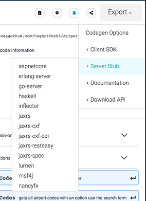

# Creating an API Specification Using Swagger

The purpose of this lab is to complete a specification for an API the support the resource Airport Codes.

An Airport Code is the abbereviaton expressed in upper case letters that identifies an aiport. You can find a complete list of airport codes with  corresponding airports [here](http://www.airportcodes.org/). For example, `LAX` indicates Los Angeles International Airport.


**Step 1:** Go the [swagger.io](swagger.io) and create an account that allows you to use SwaggerHub to create an API specification using the online Swagger Editor.


**Step 2:** View [this 10 minute video](https://www.youtube.com/watch?v=-dG2984SDyQ&t=2s) created by Bob Reselman that provides a brief overview for using Swagger Hub. (Bob Reselman is an instructor for Innovation in Software.)


**Step 3:** Create an API sepcification for Airport Codes the describes the following endpoints:

```text
GET api/airportCodes/{id}
GET api/airportCodes
POST api/airportCodes
```

An airportCode is defined as:

```javascript
{
  airport: string,
  code: string
}
```

Make it so that `GET api/airportCodes` supports a query parameter, `searchTerm` that allows a user to declare an airport to search for.

You can use this "starter" Swagger specification file, [started-airport-code.yaml](starter-airport-code.yaml).

**Step 4:** Once your specification is complete use SwaggerHub Editor's export feature to generate a server stub in the language of your choice.



**Step 5:** Get your server up and running on your local machine.

**Step 6:** Use Postman to exercise your server stub. If you don't have Postman installed on your machine, go [here](https://www.getpostman.com/downloads/) to learn how to install the it.

Contact your instructor if you need clarification, experience any problems or have any questions you need answered.

**Step 7:** Once you are done working the lab, you can compare your work to the example that in this zip file, `airport-codes.zip`. The zip
file is password protected. Contact the instructor to get the password you need to open the zip file. Execute the following command to download the file, airport-codes.zip

`curl -LO https://github.com/reselbob/innosoft-adv-microservices/blob/master/airport-codes.zip`

**Congratulations!** The exercise is complete.