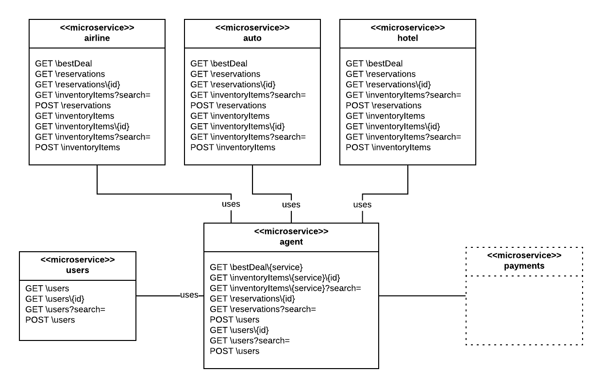
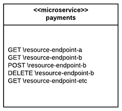

# Adding a Payments Microservice to Travel Agent

The purpose of this lab is to have students design and implement a `payments` microservice for the microservice oriented application (MOA) Travel Agent.

## Background

Presently the microservice oriented application (MOA) Travel Agent supports 5 microservices, `auto`, `airline`, `hotel`, `users` and `agent`

**WHERE**

* `auto` is the microservice that provides auto inventory information and supports making and reporting the auto reservations. Also, `auto` provides a "Best Deal" on demand.

* `airline` is the microservice that provides airline inventory information and supports making and reporting the airline reservations. Also, `airline ` provides a "Best Deal" on demand.

* `hotel` is the microservice that provides hotel inventory information and supports making and reporting the hotel reservations. Also, `hotel ` provides a "Best Deal" on demand.

* `users ` is the microservice that registers and reports about users of the MOA. 

* `agent` is the microservice that supports making and reporting overall reservations that include `auto`, `airline` and `hotel` assigning a `user` that is registered or will be registered to the MOA. The microservice, `agent` is the "Entry Point" to the MOA overall.

## The Assignment

As you can see from the illustration displayed above, the Travel Agent MOA needs to have a `payments` microservice that supports payment activity for one, many, all or any microservice with the MOA.

Your assignment is a three step process.

**First**, design the `payments` microservice at a logical level. This design can be expressed as an informal diagram as shown below.

**Second**, create a specification in Swagger that describes your design of the Payments service as a RESTful API.

Feel free to use this "starter" specification, [starter-payments.yaml](starter-payments.yaml) to save time and get you on your way.

**Third**, implement your version of `payments` in any language you like, using any storage technology you like. 

You should make it so that your implementation can be encapsulated into a Docker Image that gets posted on Docker Hub. Once on Docker Hub, another developer should be able to create and configure a Docker container using your image and get it up and running within the Travel Agent MOA.

**NOTE:** This is a fairly complex assignment. You do not have to complete all of it. _It's about the journey, not the destination._ A reasonable approach is to focus on each step as a discrete deliverable that can be handed off to another party for completion.

Also, **in terms of working with Swagger and Docker**, you are expected to have a general understanding of the technologies. Mastery of the operational details is not required. Rather, consider the instructor to be your "expert Swagger/Docker consultant". Do your design work and then call upon the instructor to help you work through the details of concrete implementation under Swagger and Docker.